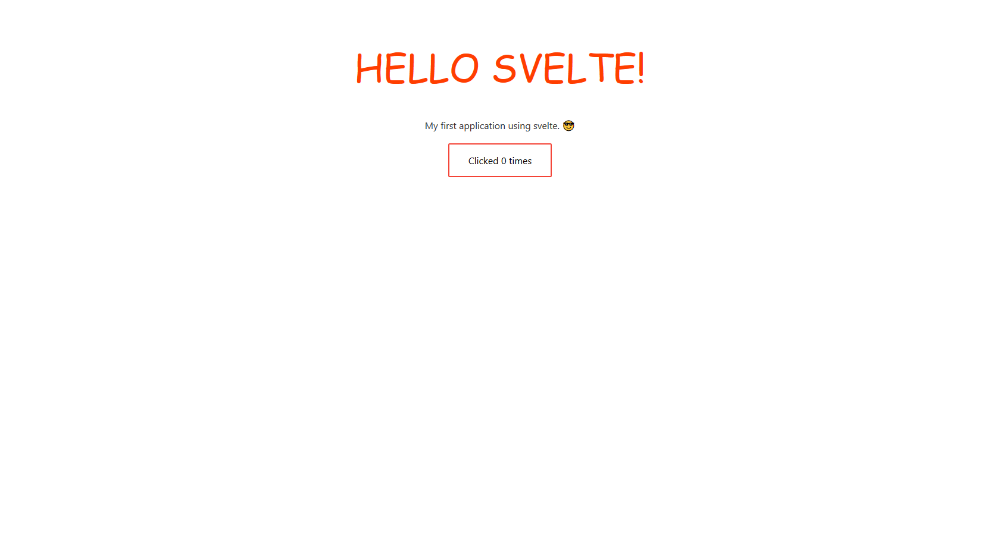

# My-first-app-svelte

My first application developed with the svelte framework.

## Table of contents

- [General info](#general-info)
- [Screenshots](#screenshots)
- [Technologies](#technologies)
- [Contact](#contact)

## General info

My first application using svelte customizing a component and adding the onclick event.🎓

## Screenshots

## Technologies

- HTML
- CSS
- JAVASCRIPT
- SVELTE

## Contact

Created by [@jhosep98](https://jhosep98.github.io/Portfolio2020jdb/) - feel free to contact me!
